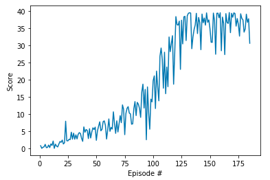
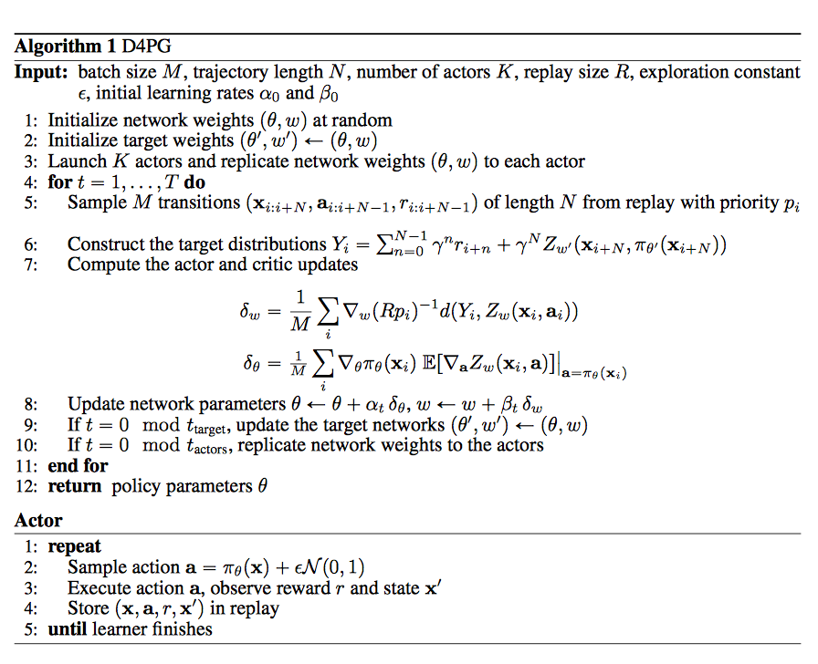

## Agent Implementation

### Deep Deterministic Policy Gradient (DDPG)

This project implements an *off-policy method* called **Deep Deterministic Policy Gradient** and described in the paper [Continuous control with deep reinforcement learning](https://arxiv.org/abs/1509.02971). 

> We adapt the ideas underlying the success of Deep Q-Learning to the continuous action domain. We present an actor-critic, model-free algorithm based on the deterministic policy gradient that can operate over continuous action spaces. Using the same learning algorithm, network architecture and hyper-parameters, our algorithm robustly solves more than 20 simulated physics tasks, including classic problems such as cartpole swing-up, dexterous manipulation, legged locomotion and car driving. Our algorithm is able to find policies whose performance is competitive with those found by a planning algorithm with full access to the dynamics of the domain and its derivatives. We further demonstrate that for many of the tasks the algorithm can learn policies end-to-end: directly from raw pixel inputs.

Deep Deterministic Policy Gradient (DDPG) is an algorithm which concurrently learns a Q-function and a policy. It uses off-policy data and the Bellman equation to learn the Q-function, and uses the Q-function to learn the policy. More details available on the Open AI's [Spinning Up](https://spinningup.openai.com/en/latest/algorithms/ddpg.html) website.

### Algorithm

This algorithm screenshot is taken from the [DDPG algorithm from the Spinning Up website](https://spinningup.openai.com/en/latest/algorithms/ddpg.html)

### Code implementation

The code is written in [Python 3.6](https://www.python.org/downloads/release/python-360/) and is relying on [PyTorch 0.4.0](https://pytorch.org/docs/0.4.0/) framework.

The code includes :

- `model.py` : Provide the **Actor** and the **Critic** classes.
    - The Actor and Critic classes each implements a *Target* and a *Local* Neural Networks used for the training.
    
- `ddpg_agent.py` : Implement the **DDPG agent** and a **Replay Buffer memory** used by the DDPG agent.
    - The Actor's *Local* and *Target* neural networks, and the Critic's *Local* and *Target* neural networks are instanciated.
    - The `learn()` method updates the policy and value parameters using given batch of experience tuples.
  
- `Continuous Control Main.ipynb` : This Jupyter notebooks allows to instanciate and train the agent. More in details it allows to :
  - Prepare the Unity environment and Import the necessary packages 
  - Check the Unity environment
  - Define a helper function to instanciate and train a DDPG agent
  - Train an agent using DDPG (including Hyperparameters evaluation)
  - Plot the score results
  
  
### DDPG parameters and results

#### Methodology

As a starting point, the initial version of the DDPG agent used the parameters values described in the paper [Continuous control with deep reinforcement learning](https://arxiv.org/abs/1509.02971). 

To improve the performance in this task, I did:
- **Increasing the number of steps per episode.**
- **Reducing the Sigma values** used in the Ornstein-Uhlenbeck noise process was another important change for the agent to start learning
- **adding the batch normalization layer after the activation layer**
- **using smaller Neural networks**
- **adjust the learning rates used**

#### Results

These results meets the project's expectation as the agent is able to receive an average reward (over 100 episodes) of at least +30, and in 185 episodes only.

### Ideas for future work

As discussed in the Udacity instructions, a further evolution to this project would be to train the 20-agents version. In that case, it might be better to use another algorithm like [PPO](https://arxiv.org/pdf/1707.06347.pdf), [A3C](https://arxiv.org/pdf/1602.01783.pdf), and [D4PG](https://openreview.net/pdf?id=SyZipzbCb) that use multiple (non-interacting, parallel) copies of the same agent to distribute the task of gathering experience.  

Distributed Distributional Deterministic Policy Gradients - [D4PG](https://openreview.net/pdf?id=SyZipzbCb)

> This work adopts the very successful distributional perspective on reinforcement learning and adapts it to the continuous control setting. We combine this within a distributed framework for off-policy learning in order to develop what we call the Distributed Distributional Deep Deterministic Policy Gradient algorithm, D4PG. We also combine this technique with a number of additional, simple improvements such as the use of N-step returns and prioritized experience replay. Experimentally we examine the contribution of each of these individual components, and show how they interact, as well as their combined contributions. Our results show that across a wide variety of simple control tasks, difficult manipulation tasks, and a set of hard obstacle-based locomotion tasks the D4PG algorithm achieves state of the art performance.

 (from the paper)

